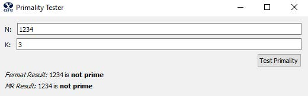
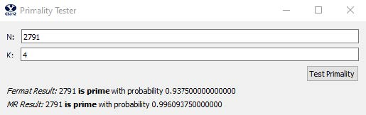
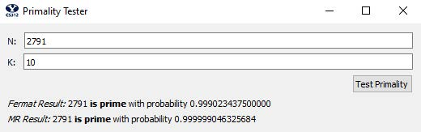
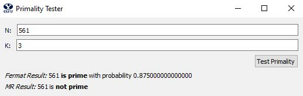

# Fermat

This projects is uses the [Fermat](https://en.wikipedia.org/wiki/Fermat_primality_test) and [Miller-Rabin](https://en.wikipedia.org/wiki/Miller%E2%80%93Rabin_primality_test) algorithms to test a given number's primality (using modular exponentiation).
(The value k indicated how many random trials.)

To see the implementation, see [fermat.py](fermat.py).

## Results

For the full report (such as Big-O complexity and explanation), see [Report.pdf](Fermat%20-%20Report.pdf)

#### Tests

